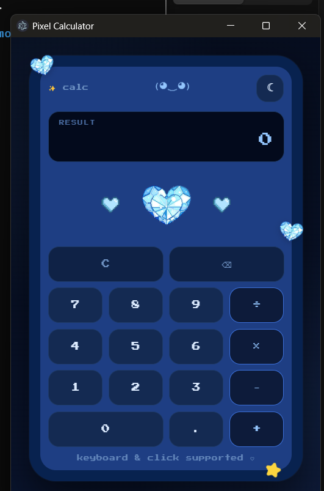
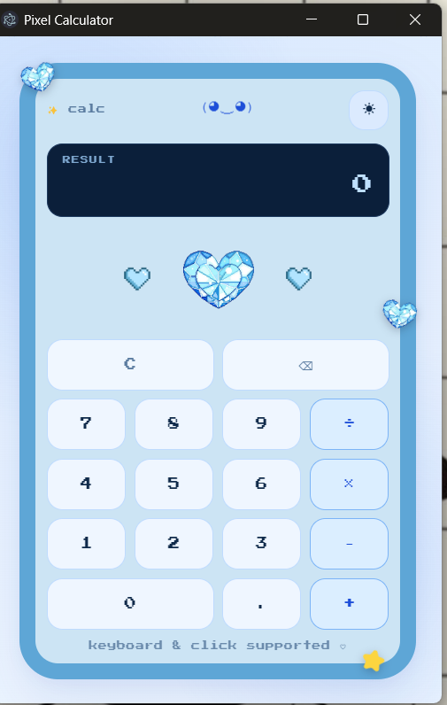

# Pixel Calculator ✨

A cute pixel-art calculator that runs both in your browser and as a desktop app.

## Features

- Pixel-style UI in cool blue (light) and midnight blue (dark) tones
- Equals key is a crystal heart photo in the upper-middle of the keypad,
  flanked by two blocky pixel hearts
- A tiny mascot face that bobs, winks on clear, and celebrates on equals
- Smooth, springy button animations and twinkling stars & hearts
- Basic math: add, subtract, multiply, divide
- Keyboard support
- Divide-by-zero shows a friendly error (and a dizzy mascot)

## Running it in a browser

1. Keep `index.html`, `styles.css`, `calculator.js`, `crystal-heart.png`,
   and `pixel-blue-heart.png` together in the same folder.
2. Open `index.html` in any browser (double-click the file).
3. Want to tweak the look? Edit `styles.css` directly and refresh the page.

Keyboard shortcuts: numbers `0-9`, `.`, `+ - * /`, `Enter`/`=` to calculate,
`Backspace` to delete, `Escape` to clear.

## Running it as a desktop app (Windows)

This is already set up and working — here's how to launch it and how it's
built, in case you move it to a new computer.

**To launch it:** double-click `launch.bat` in the project folder (or the
desktop shortcut, if you made one).

**How it's built:** the folder contains an Electron wrapper —
`main.js` and `package.json` — which packages the calculator into a real
window. The actual Electron program lives inside
`node_modules\electron\dist\` once installed, and got renamed to
`pixel calculator.exe` to match the app's product name. `launch.bat` starts
that exe directly, pointed at the project folder, and exits immediately so
no black command-window lingers.

### Setting it up on a different computer

1. Install [Node.js](https://nodejs.org) (LTS version).
2. Copy this whole folder to the new machine.
3. Open a terminal in the folder and run:
   ```
   npm install
   npm install-scripts approve electron
   npm rebuild electron
   ```
4. Check `node_modules\electron\dist\` for the `.exe` — if it got renamed
   (e.g. to `pixel calculator.exe`), update the path inside `launch.bat`
   to match.
5. Double-click `launch.bat` to run it.

**Note:** if the project folder lives inside OneDrive, extraction can fail
intermittently — OneDrive's background sync interferes with the thousands
of files Electron installs. If you hit install errors, either move the
project outside OneDrive (e.g. `C:\Projects\...`) or add a Windows Defender
exclusion for the folder before installing.

## Screenshots

<p align="center">
  
  
</p>

